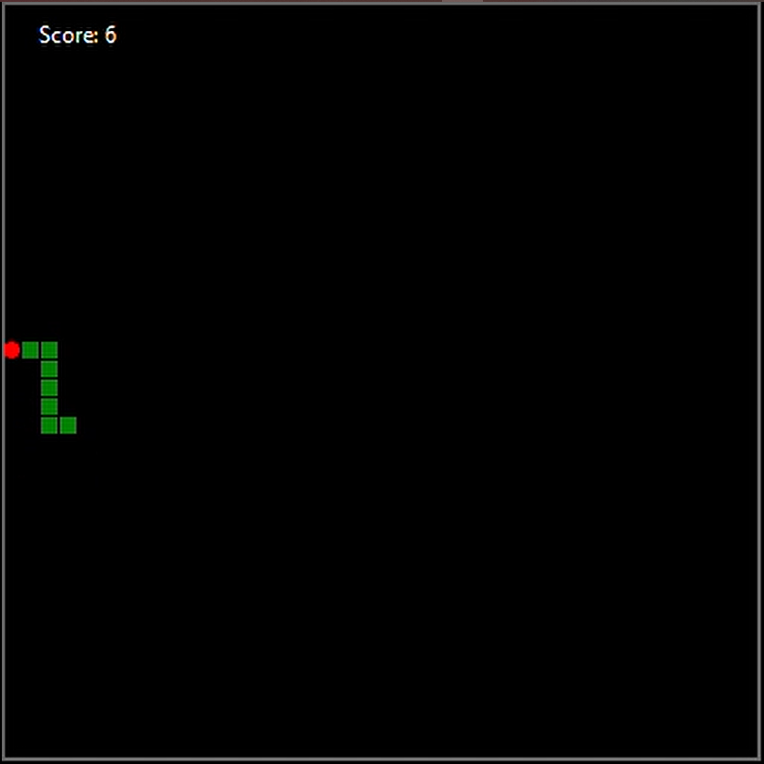
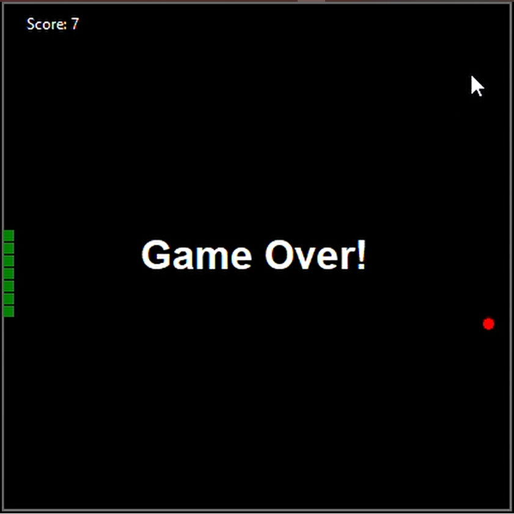

# Warm Game
**Warm Game** is an interactive Python game where players must navigate through various challenges to reach the maximum length. This project is a sample from a class I taught as a volunteer at my university, aimed at demonstrating practical applications of Python programming. The game is designed to be engaging and fun, utilizing Python's libraries for graphics and game development.

